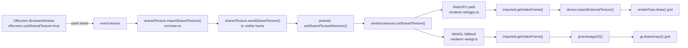
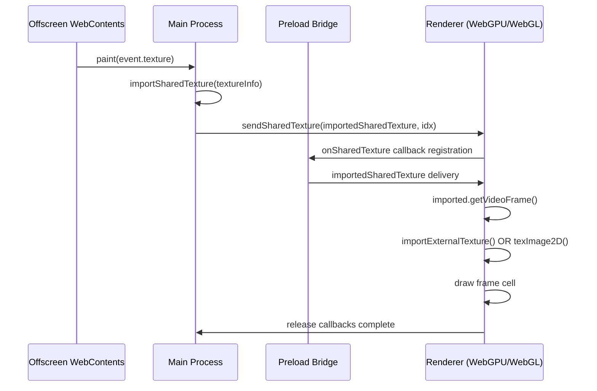

## Shared Texture Pipeline (Producer -> Consumer)

This project uses Electron shared textures from an offscreen renderer and consumes them in the visible renderer via WebGPU (with WebGL fallback).

### Producer (main process)

- File: `src/main.ts`
- Offscreen sources are created with shared texture enabled (`offscreen.useSharedTexture = true`).
- The producer frame arrives in `osr.webContents.on("paint", ...)` as `event.texture`.
- That native texture is wrapped with `sharedTexture.importSharedTexture(...)`.
- The imported texture is transferred to the visible renderer with `sharedTexture.sendSharedTexture(...)`.

In short: Chromium offscreen rendering produces the texture; `main.ts` packages and sends it.

### Bridge (preload)

- File: `src/preload.ts`
- `sharedTexture.setSharedTextureReceiver(...)` receives payloads sent from main.
- `contextBridge.exposeInMainWorld("textures", { onSharedTexture(...) })` forwards the imported shared texture to renderer code.

### Consumer (renderer)

- Primary consumer file: `src/renderer-webgpu.ts`
- Entry point in page: `index.html` loads `dist/renderer-webgpu.js`
- Renderer callback receives `Electron.SharedTextureImported`.
- `imported.getVideoFrame()` converts the shared texture handle to a `VideoFrame`.
- `device.importExternalTexture({ source: frame })` converts it to `GPUExternalTexture`.
- Render loop samples that external texture and draws into a 4x4 grid.

Fallback path:

- `src/renderer-webgl.ts` receives the same shared texture event.
- It also calls `imported.getVideoFrame()`, then uploads via `gl.texImage2D(...)`, and draws with WebGL.

## Diagram: End-to-End Data Flow

## Diagram: Single Frame Lifecycle

